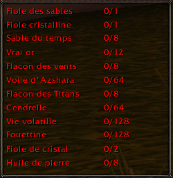
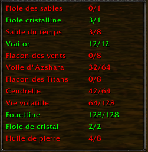
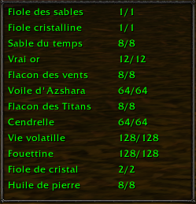

# VoSList
## Description
**VoSList** est un addon pour **World of Warcraft** qui permet de suivre facilement la liste des composants pour la **Vial of Sand**.  
L’addon affiche en temps réel vos items, avec un code couleur :  

- **Vert** : vous possédez suffisamment de l’item  
- **Rouge** : vous n’avez pas encore assez  

Vous pouvez voir votre progression complète et savoir rapidement quels composants vous manquent.

---

## Fonctionnalités

- Affichage en **temps réel** des composants.  
- **Deux colonnes** : nom de l’item et quantité possédée / requise.  
- La fenêtre s’adapte automatiquement à la hauteur du texte.  
- Mise à jour toutes les 0,5 secondes.  
- Couleurs vert/rouge pour indiquer si l’item est complet ou non.

### Aperçu
---
<table align="center">
<tr>
  <td align="center">
    <b>Liste vide</b> 
    
  </td>
  <td align="center">
    <b>Progression en cours</b> 
    
  </td>
  <td align="center">
    <b>Liste complète</b> 
    
  </td>
</tr>
</table>

---

---

## Installation

> **Important** : assurez-vous que le jeu est **fermé** avant d’installer l’addon. Sinon, vous devrez redémarrer WoW pour que l’addon fonctionne correctement.

1. [Téléchargez la dernière version](https://github.com/GwendalT35/VoSList/releases/latest) de VoSList.  
2. Accédez au dossier `World of Warcraft\_retail_\Interface\AddOns`.  
3. Extrayez le contenu de `VoSList.zip` dans ce dossier.  
4. Lancez le jeu et profitez de votre suivi d’items ! 🎉

---

## Support et Contributions

- Pour signaler des bugs ou proposer des améliorations, utilisez les **Issues** sur le [GitHub](https://github.com/GwendalT35/VoSList).  
- Contributions bienvenues via **pull requests** !  

---

